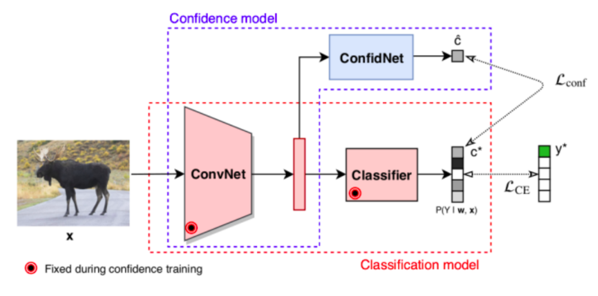
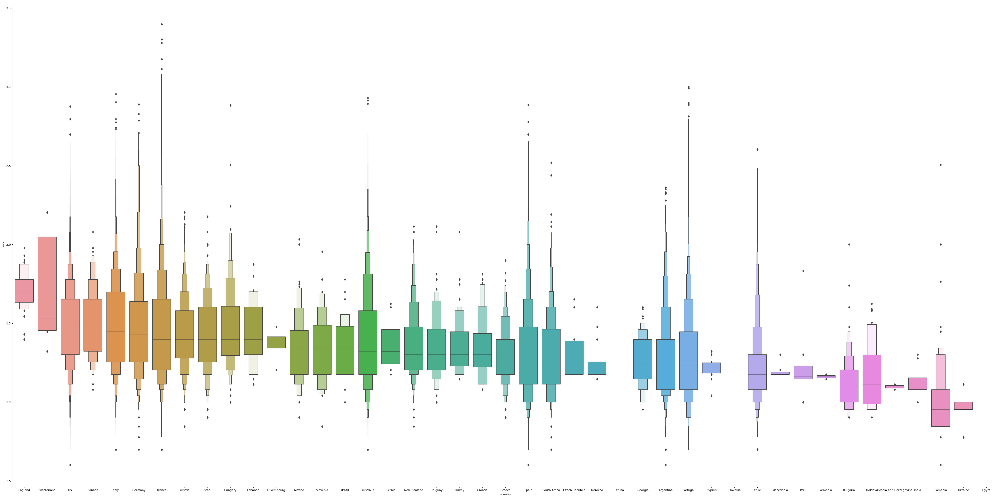
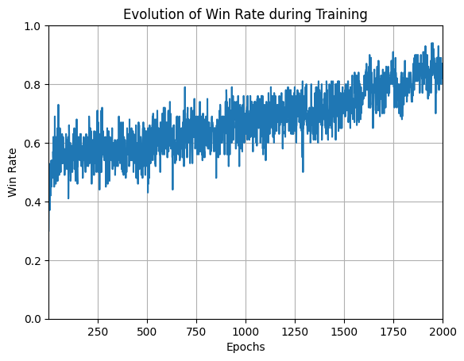

## Sélection de projets de Data Science, d'IA et de Développement Web

---

### 1. Stage de recherche : Estimation d’incertitude dans les réseaux de neurones
Les réseaux de neurones profonds sont très performants, mais leur manque d'explicabilité les rend délicats à utiliser, notamment en milieux sensibles comme le médical. Dans ce projet, j’ai étudié et ré-implémenté des approches avancées d’estimation de l’incertitude (Monte Carlo Dropout, ConfidNet) et proposé de nouvelles méthodes pour améliorer l’état de l’art.

<a href="/pdf/Rapport_de_Stage.pdf" target="_blank" rel="noopener noreferrer">
  Voir l'Abstract
</a>

---

### 2. Segmentation d’une base de données client (projet marketing)
Sur une base de 900 000 clientes, j’ai mis en place un pipeline de segmentation afin de créer des profils clients interprétables. L’objectif était de mieux comprendre les comportements d’achat et de guider des actions marketing ciblées.

<a href="/pdf/Projet_SEGBO.pdf" target="_blank" rel="noopener noreferrer">
  Voir le Rapport
</a>

---

### 3. Prédiction de la note d’un vin (classification multiclasse)
À partir des données de 130 000 vins, j’ai conçu un modèle pour prédire leur note decernée par des critiques (1 à 5 étoiles). Après un nettoyage approfondi des variables (prix, région, cépage, descriptifs de dégustation), j’ai implémenté une régression logistique puis un XGBoost, obtenant d’excellents résultats.

<a href="/pdf/Projet_SDE_Victor_GUILLARD.pdf" target="_blank" rel="noopener noreferrer">
  Voir le Rapport
</a>

---

### 4. Reinforcement Learning : IA pour jouer au Puissance 4
J’ai développé un agent de Reinforcement Learning (Q-learning) capable de jouer au Puissance 4. Cela m’a permis de comprendre plus finement la dynamique de l’apprentissage par récompenses et la gestion des états de jeu.

---

### 5. Chatbot d’assistance aux hôtes d'accueil (RAG)
J’ai développé un système de chatbots pour assister les hôtes d’accueil et leurs managers, en utilisant un algorithme Retrieval-Augmented Generation (RAG). Le premier chatbot répond aux questions courantes des hôtes d'accueil en s’appuyant sur la base de connaissances interne, tandis que le second chatbot permet aux managers de mettre à jour cette base, en collectant et résolvant les questions restées sans réponse.

<a href="images/PipelineRAG.png" target="_blank" rel="noopener noreferrer">
  Voir un diagramme explicatif de la pipeline RAG
</a>

---

### 6. Application Web en Go (Echo, Tailwind, Docker)
J’ai développé une web app inspirée de ChatGPT. Les utilisateurs peuvent s’inscrire, se connecter et interagir avec un LLM via un chat. L'authentification est gérée de manière sécurisée (hash de mots de passe, protection CSRF, sessions en base, etc.). L’UI a été conçue avec Tailwind CSS et DaisyUI pour apporter un rendu moderne, et l’ensemble du projet s’appuie sur un pipeline CI/CD (GitHub Actions) pour un déploiement fluide sur Google Cloud Run. Ce projet se distingue par sa modularité (architecture claire en Go et Echo), son approche sécurisée (sessions, cookies, rôles), et sa pipeline de CI/CD (tests et builds Docker automatisés), permettant de déployer rapidement de nouvelles fonctionnalités et de scaler facilement.

Vous pouvez tester cette web app en cliquant sur le lien ci-dessous et en vous connectant avec les identifiants suivants.  
<b>Nom de compte</b> : example@example.com  
<b>Mot de passe</b> : Achanger123!  
<b>Note</b> : Il y a actuellement un quota limite de réponses par minute, c'est donc normal que le site renvoie une erreur 500 si le quota est dépassé.

<a href="https://avestaai.com" target="_blank" rel="noopener noreferrer">
  Lien vers l'application web
</a>
