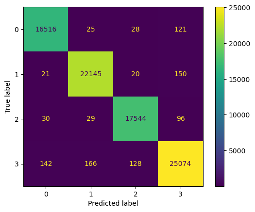

## Sélection de projets de Data Science, d'IA et de Développement Web

---

### 1. AvestaAI — Application web SaaS en Go sur GCP

J’ai développé AvestaAI, une application web SaaS destinée aux praticiens de santé indépendants.  
La plateforme leur permet de créer en quelques minutes un site web professionnel multilingue avec un assistant IA intégré qui répond aux questions des patients à partir de la documentation du cabinet.

**Points clés :**
- Architecture modulaire en Go (Echo) avec rendu serveur (HTMX, Templ) et interface moderne (Tailwind CSS, DaisyUI).
- Déploiement sur Google Cloud Run avec base de données PostgreSQL (Cloud SQL), gestion des sous-domaines et multi-tenant.
- Facturation récurrente via Stripe et CI/CD automatisée (Docker, GitHub Actions) pour tests, build et déploiement.

<a href="https://avestaai.com" target="_blank" rel="noopener noreferrer">
  Lien vers l'application web
</a>

---

### 2. Chatbot d’assistance aux hôtes d'accueil (RAG)

Développement d’un système de chatbots pour assister les hôtes d’accueil et leurs managers, basé sur Retrieval-Augmented Generation (RAG).

**Points clés :**
- Un chatbot répond aux questions courantes des hôtes d’accueil à partir d’une base de connaissances interne.
- Un second chatbot permet aux managers de compléter et corriger cette base en collectant les questions non résolues.
- Pipeline RAG structuré : ingestion des documents, indexation, recherche, génération de réponse par LLM.

<a href="images/PipelineRAG.png" target="_blank" rel="noopener noreferrer">
  Voir un diagramme explicatif de la pipeline RAG
</a>

---

### 3. Stage de recherche : Estimation d’incertitude dans les réseaux de neurones

Les réseaux de neurones profonds sont très performants, mais leur manque d’explicabilité les rend délicats à utiliser en milieux sensibles (médical, sécurité…).  
Dans ce projet de recherche à l’ISIR (Sorbonne Université), j’ai étudié et ré-implémenté des méthodes avancées d’estimation de l’incertitude et proposé des améliorations.

**Points clés :**
- Ré-implémentation de méthodes comme Monte Carlo Dropout et ConfidNet.
- Conception de protocoles d’évaluation et d’expériences sur des jeux de données de vision.
- Analyse de la calibration et de la fiabilité des prédictions des réseaux de neurones.

<a href="/pdf/Rapport_de_Stage.pdf" target="_blank" rel="noopener noreferrer">
  Voir l'Abstract
</a>

---

### 4. Segmentation d’une base de données client (projet marketing)

Sur une base de 900 000 clientes, j’ai mis en place un pipeline de segmentation pour créer des profils clients interprétables et actionnables pour le marketing.

**Points clés :**
- Préparation et normalisation de données clients (comportement d’achat, fréquence, panier moyen).
- Application de méthodes de clustering et analyse des segments obtenus.
- Construction de profils clients pour guider des campagnes ciblées.

<a href="/pdf/Projet_SEGBO.pdf" target="_blank" rel="noopener noreferrer">
  Voir le Rapport
</a>

---

### 5. Prédiction de la note d’un vin (classification multiclasse)

À partir des données de 130 000 vins, j’ai conçu un modèle pour prédire la note décernée par des critiques (1 à 5 étoiles).

**Points clés :**
- Nettoyage et préparation des variables (prix, région, cépage, description de dégustation).
- Comparaison de modèles : régression logistique vs XGBoost.
- Évaluation de la performance et analyse des facteurs influençant la note.

<a href="/pdf/Projet_SDE_Victor_GUILLARD.pdf" target="_blank" rel="noopener noreferrer">
  Voir le Rapport
</a>

---

### 6. Reinforcement Learning : IA pour jouer au Puissance 4

Agent de Reinforcement Learning (Q-learning) capable de jouer au Puissance 4.

**Points clés :**
- Représentation des états de jeu et définition de la fonction de récompense.
- Implémentation du Q-learning et étude de la convergence.
- Analyse de l’évolution du taux de victoire en fonction des hyperparamètres.

